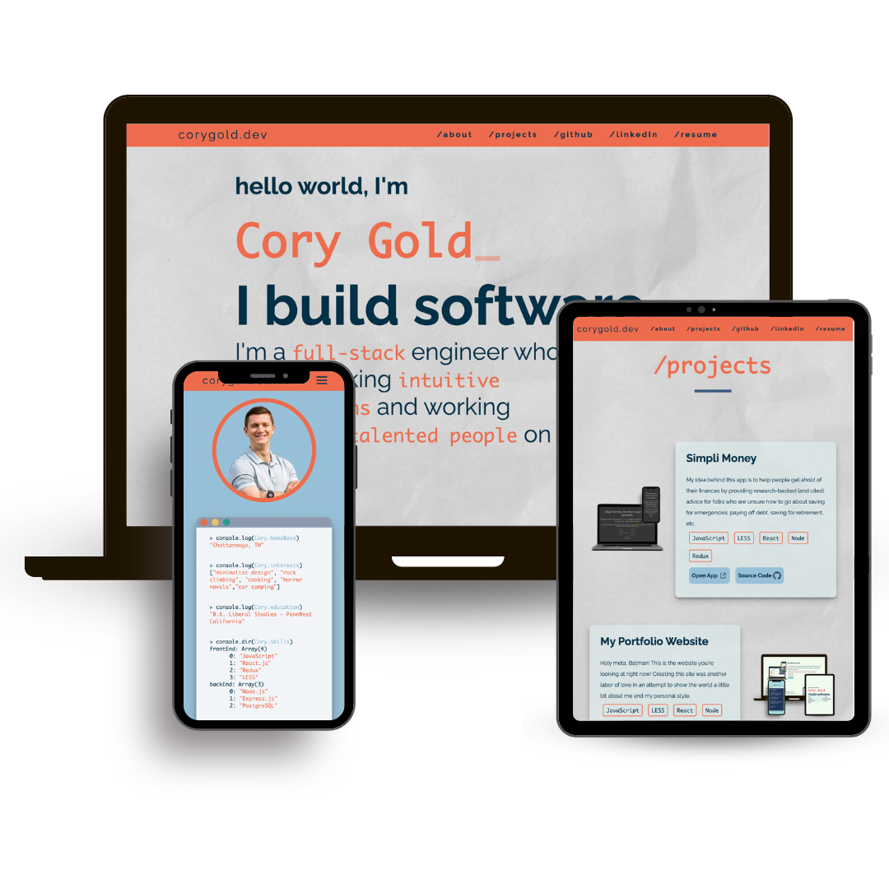

# CoryGold.dev

I created this project in order to show the little world a little bit about me and some of the projects I have worked on. It was an absolute labor of love, and I had a fantastic time building it!

## Getting Started
### Local Machine (command line)
- <code>$npm i</code>
- <code>$npm start</code>

### Browser
- It's as easy as navigating to www.corygold.dev and having a peek around :-)

## Technologies Used

For this project, I used: 
- JavaScript
- React
- Node
- Less

## What I Learned
- React packages are your friends! I used a couple of different packages to take some of the workload of my shoulders and provide some super neat features such as the typewriter effect!
- I became more comfortable with CSS animation syntax (as well as toeing the line between too little and TOO MANY animations.
- It sounds simple, but I became much more comfortable with using static resources such as images inside of a React application.

